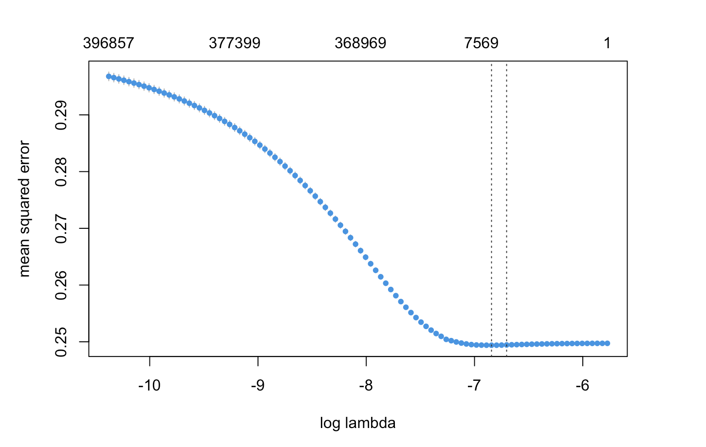
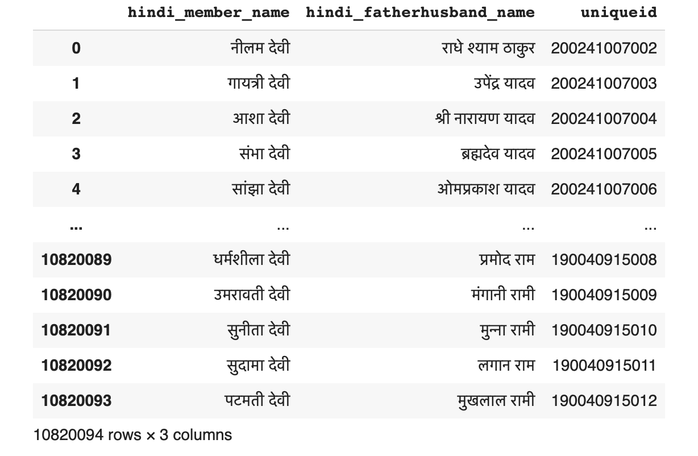

# Portfolio
---

## Natural Language Processing

### Income Dynamics Lab : Natural Language Processing using Bigrams and Lasso regression

As an undergraduate research assistant I was coding the NLP workflow to convert Congressional speech data into bigrams to use as regressors in gamma Lasso regression from the 'gamlr' package. Lasso was used here as a regularization method to select the most relevant features (i.e. words) to predict political slant.

## Data Processing

### Income Dynamics Lab : Advanced Data Integration: Linking Self Help Group (SHG) and Job Card Data using Fuzzy Matching Techniques
 The goal of this project is to link Self Help Group (SHG) members data with Job Card Data from India. The code uses fuzzy matching techniques to match location information between the two datasets using the recordlinkage library. The output is a DataFrame containing the potential matches based on a defined match percentage. Overall, this script demonstrates an ability to handle and manipulate large datasets, use advanced data cleaning techniques, and implement record linkage procedures for data integration.
 
 
 

 

---

© 2023 Maximiliaan Landesz. Powered by Jekyll and the Minimal Theme.

